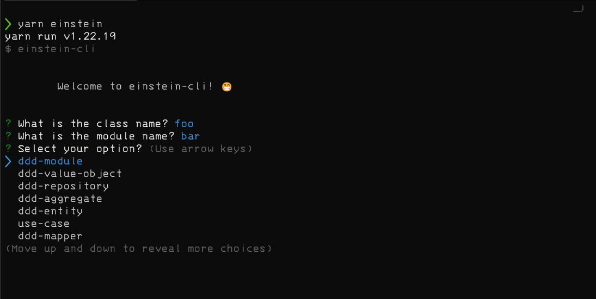

# Einstein Template - Backend NestJS

Este template possui comandos automatizados para gerar componentes para a construção do backend.
Os comandos podem ser executados com:

- `yarn` 
- `npm`
- `make`

---

## Como utilizar a cli

Antes de tudo instale as dependências


```sh

$ yarn

```

Utilizando a cli com yarn


```sh

$ yarn einstein

```



Utilizando a cli com npm

```sh

$ npm run einstein

```

Utilizando a cli com make.

Existem algumas opções pré-definidas.

- Para criar um módulo

```sh

$ make module

# Ou

$ make mod

```

- Para criar um recurso

```sh

$ make resource

# Ou

$ make res

```

---

## Gerenciador de pacotes

Para instalar e gerenciar novos pacotes (libs) utilize yarn.

Dependência de produção

```sh

$ yarn add <package-name>

```

Dependência de desenvolvimento

```sh

$ yarn add <package-name> -D

```

---

## Alias Path

Este template já possui um alias global `@modules` e `@shared` configurado

- `@modules/*` aponta para o caminho `src/modules/*`
- `@shared/*` aponta para o caminho `src/shared/*`

Para adicionar novos alias siga o modelo nos arquivos: 
- `tsconfig.json`  
- `jest-e2e.json` 
- `jest.config.json` 

A inclusão deve ser feita em todos esses 3 arquivos.

---

## Scripts

Testes. 

Executar testes unitários.

obs: Os teste unitários devem ter o padrão de nome `<file-name>.spec.ts`


```sh

$ yarn test


```

Executar testes de integração.

obs: Os teste de integração devem ter o padrão de nome `<file-name>.test.ts`

```sh

$ yarn test:e2e


```

Executar a aplicação em watch mode

```sh

$ yarn start:dev

```

Executar a aplicação

```sh

$ yarn start

```

Para verificar se a aplicação está ok

```

GET http://localhost:3000/healthCheck

```

---

## Documentação

Este template já está configurado com swagger

Após iniciar a aplicação basta acessar o endpoint

```

GET http://localhost:3000/docs

```

## Variáveis

As variáveis de ambiente devem ser definidas no arquivo

`src/shared/env.ts`


## Commits

Os commits devem seguir a convenção do commit lint

```sh

<type>[optional scope]: <description>

[optional body]

[optional footer(s)]

```
- `feat`: nova feature
- `build`: mudanças que afetam o processo de build 
- `chore`: instalação de lib, ou configuração de ferramentas
- `ci`: configuração de script ou processos do pipeline
- `docs`: atualização de documentação
- `style`: mudanças que afetam o estilo do código, formatação etc
- `refactor`: alteração ou melhoria de código que não seja bug ou feature
- `perf`: melhorias de código que melhoram a performance
- `test`: adicionado testes ou correção de algum

Exemplo:

```sh

$ git commit -m "test (payment): ensure payment confirmation"

```
